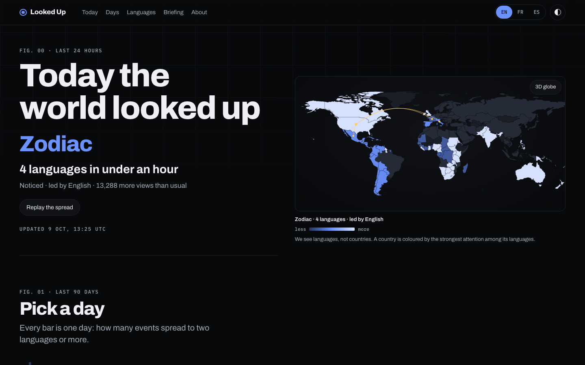
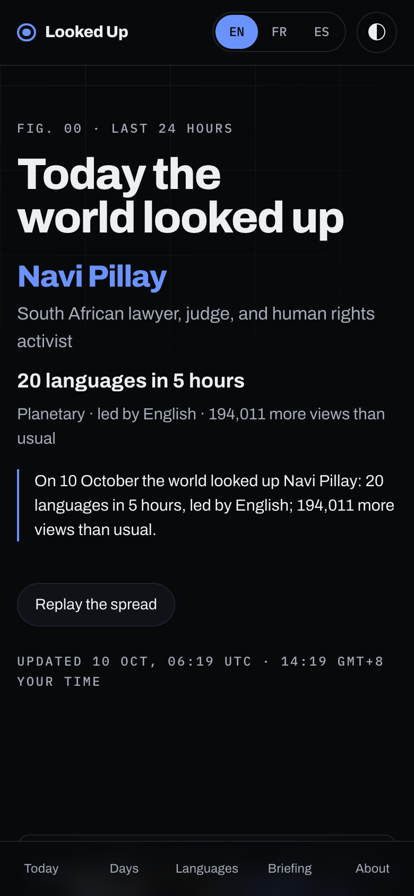
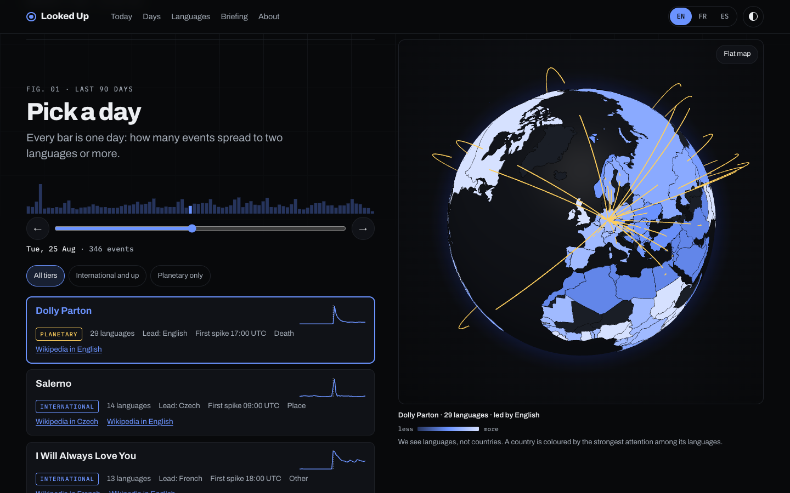
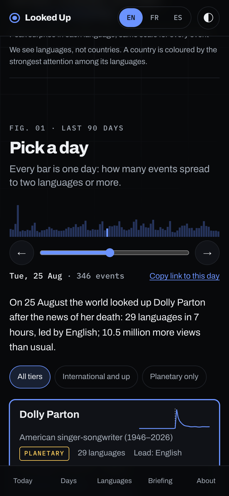
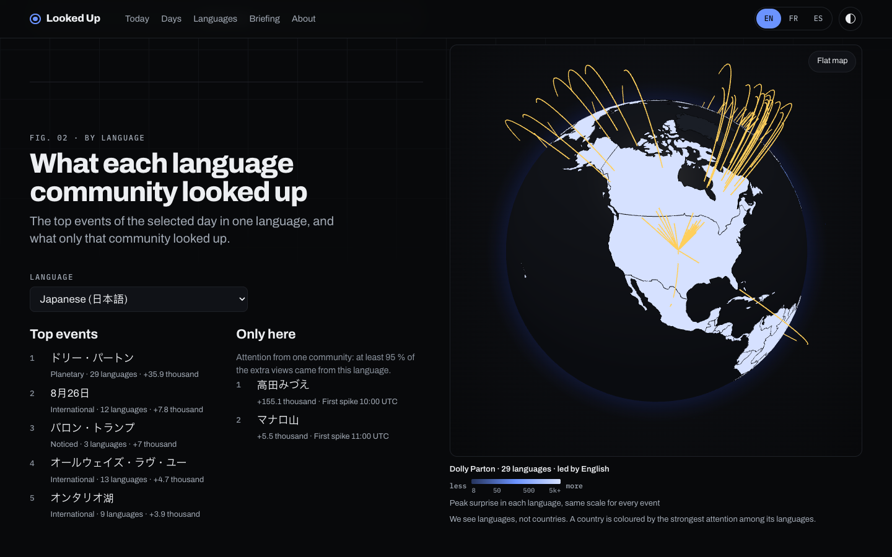
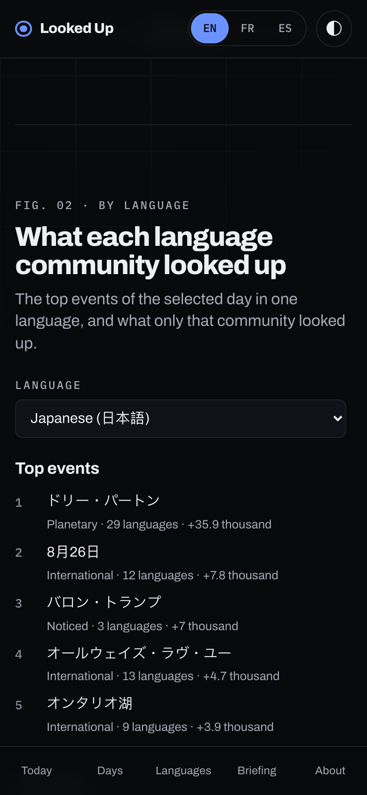

# looked-up

**What the world pays attention to, hour by hour, across languages.** Looked Up reads Wikipedia's public
pageview dumps, published every hour for more than 300 language editions. It turns them into a small, clean lake
that shows how much attention each topic gets, in which language communities, how it spreads and how long it
lasts. Articles are unified across languages through Wikidata, so "Lisbon", "Lisboa" and "リスボン" are one topic.

Pageviews are the **attention measure**. Edits (the live EventStreams feed) are the **fast signal**: editors react
within minutes, while the hourly dumps arrive ≈ 2 h after each hour. Edits come in a later phase. See the
[feasibility study](docs/feasibility.md) for the measurements behind these choices.

Built with Python, DuckDB and Parquet on free infrastructure only: GitHub Actions for compute, Hugging Face for
storage. CC0 data in, open data out.

## Status

**Live app: [sbaiii.github.io/looked-up](https://sbaiii.github.io/looked-up/).** What the world looked up today and
over the last 90 days, across 30 languages, in English, French and Spanish.
- **Hero:** the strongest event of the last 24 h: most excess views, and at least 100,000 of them or international
  breadth. On quiet days it widens to 48 h, then 7 days ([ADR 0024](docs/adr/0024-hero-selection.md)).
- **Map:** coloured by language on one absolute scale ([ADR 0025](docs/adr/0025-absolute-colour-scale.md)), with
  the spread from language to language.
- **Days:** a day scrubber, per-language top lists, and a briefing that follows Wikidata gender
  ([ADR 0026](docs/adr/0026-descriptions-and-gender.md)).
- **Shareable URLs:** `#/day/2026-08-25`, `#/day/2026-08-25/event/Q180453`, `#/lang/ja`.

| | Desktop | Phone |
|---|---|---|
| Today |  |  |
| A day |  |  |
| Languages |  |  |

**Phase 4, forecasting.** Pre-registered ([prereg](docs/prereg_phase4.md), [results](docs/analysis/phase4_results.md)):
- **Will it go international?** An hour after detection: AUC 0.875 on 17 unseen days, roughly calibrated (H6 supported).
- **Fame alone** gets only 20 % of the model's PR AUC (H7 rejected). The early reading matters more.
- **Attention left in the next 24 h:** 26 % smaller error than a decay rule (H8 supported). The fade time isn't
  better than a rule.
- **In the app:** open events get a "Spreading" badge at ≥ 50 % and a fade ETA. Models retrain on Mondays
  (`data/models/` on the Hub).

**Live, scoring hourly.** GitHub Actions adds each newly published hour of 30 Wikipedias to the public dataset
[`Sbaiiiiii/looked-up`](https://huggingface.co/datasets/Sbaiiiiii/looked-up). After each ingest it scores the hour
for **attention events**: one entity spiking in ≥ 2 languages within 6 hours against its own 28-day baseline.
- **Tiers** grade events by breadth: noticed ≥ 2, international ≥ 5, planetary ≥ 20 languages
  ([ADR 0021](docs/adr/0021-product-tiers.md)).
- Single-language events have their own list.
- It writes `data/latest.json` and the app's JSON under `data/app/`
  ([ADR 0022](docs/adr/0022-app-data-exports.md)).
- A daily job at 03:30 UTC refreshes the baselines, which are kept in the Actions cache.
- The lake holds every hour since 9 Jul 2026. Operations: [docs/ops.md](docs/ops.md).

The app ([`app/`](app/)) is plain HTML, CSS and JavaScript with no build step and no tracking.
- The 3D globe ([globe.gl](https://github.com/vasturiano/globe.gl), vendored) loads only after the first
  interaction. Devices without WebGL, or low-end ones, keep the flat SVG map.
- The globe is coloured by language, not country ([ADR 0023](docs/adr/0023-language-geography.md)).
- Pages deploys it from `app/` on push. Data comes straight from the Hub, which allows CORS.
- Lighthouse on the live site: mobile 97 / 100 / 100 / 100, desktop 100 / 100 / 100 / 100 (performance,
  accessibility, best practices, SEO).
- Each day also gets a social card, `data/app/og/YYYY-MM-DD.png` ([ADR 0027](docs/adr/0027-social-cards.md)). The
  static site shares the default card.

**Phase 2, in one paragraph.** The definitions were pre-registered before any code
([prereg](docs/prereg_phase2.md)) and evaluated against Wikipedia's Current events portal
([results](docs/analysis/phase2_results.md)):

- 84 days, 11,127 events.
- **All four hypotheses failed or were inconclusive.** Recall of portal entries was 4.3 %, and spread was slower for
  deaths than for sports.
- The portal and reading attention measure different things. 25 of the 30 largest events the portal misses are
  real, mostly deaths, which the portal's daily pages don't list, and the World Cup final.
**Phase 2b, in one paragraph.** A second pre-registration ([prereg](docs/prereg_phase2b.md)) tested sudden,
timestamped events ([results](docs/analysis/phase2b_results.md)):

- 32.5 % of notable deaths were detected within 24 h: 23 % for people with articles in 5–9 languages, 54 % for
  people with 20 or more.
- 3 of 9 M6.5+ earthquakes were detected within 6 h.
- Both in-period World Cup matches were detected at kick-off.
- When it fires, it fires in the trigger's hour: median 0 h after a quake, −1 h relative to the first death edit.
- H1b was rejected for deaths and quakes. The other tests had too few items to conclude.

- The analytics code lives in [`lookedup/analytics`](lookedup/analytics) and the dbt warehouse in
  [`warehouse/`](warehouse) ([docs](docs/warehouse.md)).

- Data model, layout and querying: [docs/data_model.md](docs/data_model.md)
- Decisions: [docs/adr/](docs/adr/)
- Languages: [config/languages.yml](config/languages.yml) (ranked by human article views; `top_n` sets how many are ingested)

## Query the lake

```bash
pip install -e .
python -m lookedup.cli top --lang fr --hour 2026-10-06T14:00     # top 20 articles, desktop vs mobile
```

Or straight from DuckDB, with no install beyond `duckdb`:

```sql
INSTALL httpfs; LOAD httpfs;
SELECT lang, title, views_desktop, views_mobile
FROM 'hf://datasets/Sbaiiiiii/looked-up/data/hourly/year=2026/month=10/day=06.parquet'
WHERE ts_hour_start = TIMESTAMP '2026-10-06 14:00'
ORDER BY views_desktop + views_mobile DESC LIMIT 20;
```

## Running the pipeline

```bash
python3.12 -m venv .venv && .venv/bin/pip install -e ".[dev]"
.venv/bin/pytest                                              # tests (also run in CI)

huggingface-cli login                                         # or export HF_TOKEN=... (never commit it)
.venv/bin/python -m lookedup.cli hourly                       # ingest missing hours of the last 7 days
.venv/bin/python -m lookedup.backfill --from 2026-07-09 --to 2026-10-06   # resumable backfill
.venv/bin/python -m lookedup.cli validate -n 3                # backfill vs hourly dumps, must be identical
.venv/bin/python -m lookedup.cli wikidata                     # rebuild Wikidata sitelinks
.venv/bin/python -m lookedup.cli languages                    # re-rank languages over the last 7 days
.venv/bin/python -m lookedup.cli push                         # upload a local lake ($LOOKEDUP_DATA_DIR/lake) + dataset card
.venv/bin/python -m lookedup.cli sync --from 2026-07-09       # mirror the lake locally (for the warehouse)
.venv/bin/python -m lookedup.cli warehouse build              # dbt build: spikes, events, tests
.venv/bin/python -m lookedup.cli evaluate                     # pre-registered Phase 2 evaluation
.venv/bin/python -m lookedup.cli evaluate-v2                  # pre-registered Phase 2b evaluation
.venv/bin/python -m lookedup.cli baselines && .venv/bin/python -m lookedup.cli score   # production scoring
.venv/bin/python -m lookedup.cli app-export [--backfill --upload]   # app JSON (data/app/), hourly or every day
npm ci && npm run serve                                       # preview the app on http://localhost:4173/
npm run test:unit && npx playwright test                      # app unit and smoke tests (also run in CI)
.venv/bin/pip install -e ".[forecast]"                        # LightGBM + scikit-learn for Phase 4
.venv/bin/python -m lookedup.cli forecast-evaluate            # pre-registered backtest (scores the test set once)
.venv/bin/python -m lookedup.cli forecast-retrain             # production models -> data/models/ (Mondays in CI)
```

Add `--local` to write to `~/looked-up-data/lake` (or `$LOOKEDUP_DATA_DIR`, kept outside iCloud) instead of Hugging Face. Workflows:
[`hourly.yml`](.github/workflows/hourly.yml) (every hour at :17: ingest, then score),
[`trigger.yml`](.github/workflows/trigger.yml) (external backup trigger),
[`pages.yml`](.github/workflows/pages.yml) (deploys `app/` to GitHub Pages),
[`hub-maintenance.yml`](.github/workflows/hub-maintenance.yml) (monthly history squash),
[`daily.yml`](.github/workflows/daily.yml) (baselines, 03:30 UTC),
[`wikidata-monthly.yml`](.github/workflows/wikidata-monthly.yml),
[`backfill.yml`](.github/workflows/backfill.yml) (manual, parallel date chunks) and
[`tests.yml`](.github/workflows/tests.yml). They need the `HF_TOKEN` repository secret; without it the scheduled jobs skip with a warning. Pipelines only
write to the lake on Hugging Face and never commit to this repository (enforced by `tests/test_no_git_in_pipeline.py`).

The Phase 0 scripts are still in [`spike/`](spike/) (see `docs/feasibility.md`).

Every request identifies itself with a descriptive User-Agent, as Wikimedia requires. Data: Wikimedia pageviews and
Wikidata, CC0.
