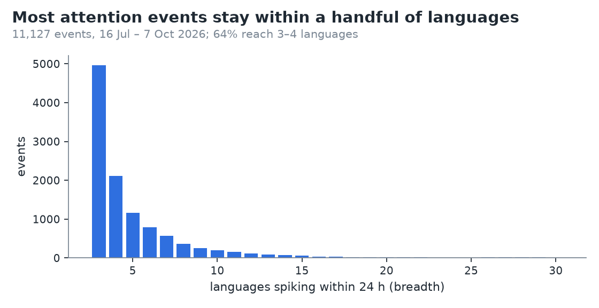
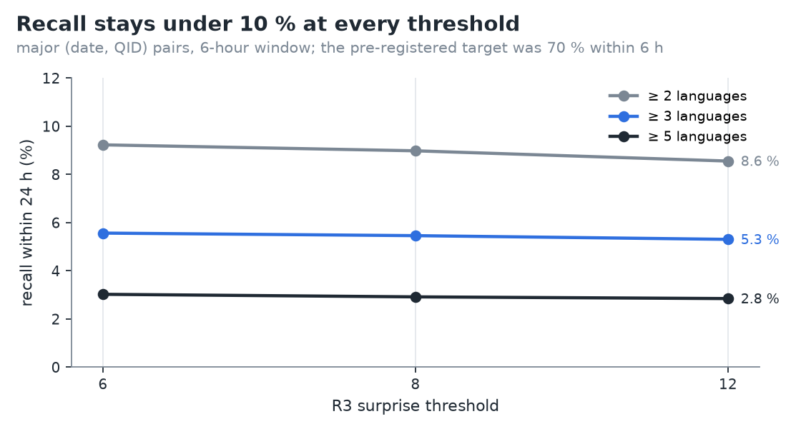
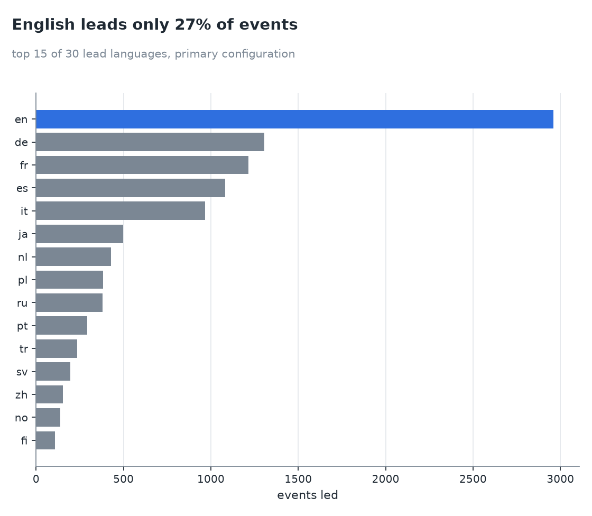
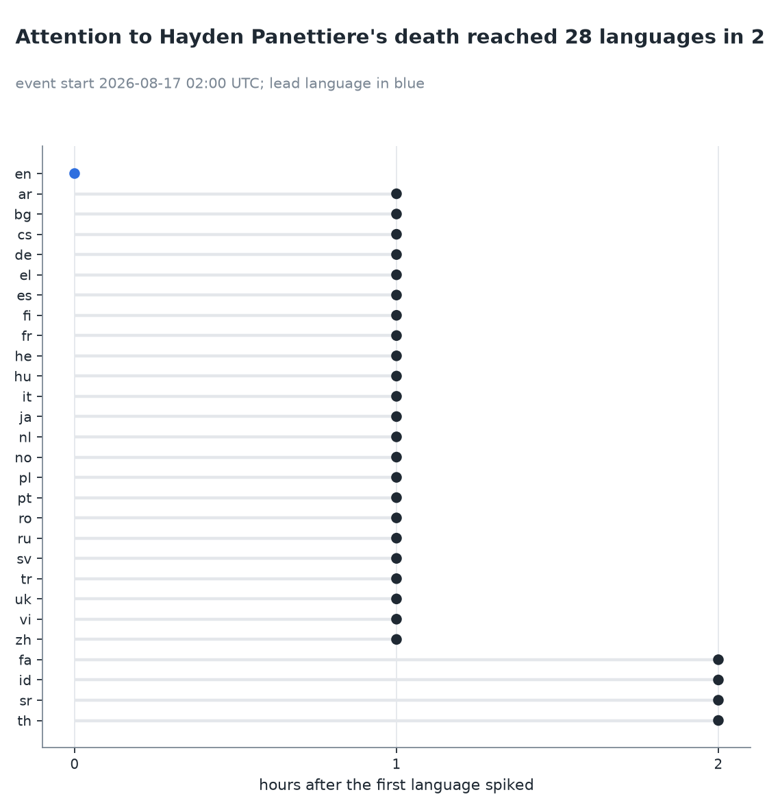

# Phase 2 results: attention events across languages

- Pre-registration: [docs/prereg_phase2.md](../prereg_phase2.md), committed 2026-10-08 before any analytics code.
- Interpretations and deviations: [ADR 0013](../adr/0013-phase2-implementation-and-deviations.md), committed before
  results, including two sensitivity analyses (S1, S2) declared before any metric was computed.
- Production approximations: [ADR 0014](../adr/0014-production-scoring.md).
- Raw outputs: [`phase2_metrics.json`](phase2_metrics.json), [`ablation_grid.csv`](ablation_grid.csv),
  [`recall_by_section.csv`](recall_by_section.csv), [`lead_counts.csv`](lead_counts.csv),
  [`detection_delays.csv`](detection_delays.csv), [`nonportal_review.csv`](nonportal_review.csv),
  [`h3_labels.csv`](h3_labels.csv), [`h3_audit.csv`](h3_audit.csv), [`h3_results.json`](h3_results.json),
  [`production_agreement.json`](production_agreement.json).

## Summary

The detector does what it was designed to do: it finds moments when the same topic suddenly draws attention in
several languages at once. Over 84 days it found **11,127 attention events** on 7,599 entities. **None of the four
pre-registered hypotheses holds**:

| Hypothesis | Pre-registered claim | Result | Verdict |
|---|---|---|---|
| **H1** detection of Current events | ≥ 70 % of major entries within 6 h | **4.3 %** (366 / 8,461) | **rejected** |
| **H2** lead language = country language | ≥ 60 % of geolocatable events | **40.7 %** (77 / 189) | **rejected** |
| **H3** automation filter removes non-events | ≥ 90 % of labelled non-events | 2 / 9 flagged (22 %) | **inconclusive** (only 9 non-events, < 20 required) |
| **H4** deaths and disasters spread faster | median lag A < B, Mann–Whitney p < 0.05 | A 2.5 h vs B 1.0 h, p = 1.0 | **rejected** (opposite direction) |

The headline is not H1. The English Current events portal and multi-language reading attention **largely measure
different things**:

- The portal lists armed conflicts, crime, politics and diplomacy. Most of those topics never draw a sudden
  multi-language reading spike.
- Readers spike on deaths, sports and entertainment. The portal's daily pages don't list deaths at all; they go to
  a separate "Recent deaths" box.
- Of the **30 largest detected events missing from the portal, 25 are verifiably real** (83 %): 15 deaths, the
  World Cup final and related news, and a celebrity marriage.

## Data and scale

| | |
|---|---|
| Period | 2026-07-09 to 2026-10-07; 7-day warm-up; scoring and evaluation 2026-07-16 to 2026-10-07 (84 days) |
| Completeness | 2,184 / 2,184 hours present in the manifest (0 gaps) |
| Article-hours scored (≥ 100 views) | 20,111,945 |
| Spike candidates (R1 or R2, surprise ≥ 6) | 2,812,876, of which 2,623,551 meet the primary rule |
| Automation-flagged candidate rows | 36,627 (1.3 %) |
| Attention events (primary config) | 11,127 on 7,599 QIDs; 64 % reach 3–4 languages, 135 reach ≥ 20 |
| Ground truth | 91 portal days, 3,689 entries, 12,083 links (99.7 % resolved to QIDs); **8,461 major (date, QID) pairs** in the evaluation period |
| `dbt build` | **44 / 44** models and tests pass ([warehouse.md](../warehouse.md)) |

Event categories (Wikidata P31/P106; `death` = P570 within the event week):

| Category | Events |
|---|---|
| sports | 4,871 |
| other | 2,648 |
| human | 1,572 |
| entertainment | 1,516 |
| death | 228 |
| place | 134 |
| organization | 61 |
| politics | 55 |
| disaster | 39 |
| science_tech | 3 |

## H1: detection of major Current events entries (rejected)

| | Pairs | Detected | Recall |
|---|---|---|---|
| **Primary: within 6 h** | 8,461 | 366 | **4.3 %** |
| Within 24 h | 8,461 | 462 | 5.5 % |
| S2: story headers only, 6 h / 24 h | 2,473 | 97 / 124 | 3.9 % / 5.0 % |
| S1: no flat rule, 6 h | 8,461 | 366 | 4.3 % |

Recall within 24 h by portal section:

| Section | Pairs | Recall 24 h |
|---|---|---|
| Sports | 632 | **21.4 %** |
| Arts and culture | 149 | 18.8 % |
| Science and technology | 238 | 13.0 % |
| Politics and elections | 718 | 12.1 % |
| Disasters and accidents | 828 | 5.1 % |
| International relations | 704 | 5.0 % |
| Law and crime | 1,244 | 3.5 % |
| Armed conflicts and attacks | 3,104 | 1.6 % |
| Health and environment | 457 | 1.5 % |
| Business and economy | 443 | 1.1 % |

- **What the low recall means.** Recall is lowest where the portal is largest. Armed conflicts are 37 % of all major
  pairs, and recall there is 1.6 %. Ongoing stories ("2026 Iran war") are linked almost every day, but readers
  don't produce a new multi-language spike every day. Sports and culture, where attention is sudden and shared,
  reach 19–21 %.
- **S2 changes nothing.** Restricting to the portal's own story headers gives 3.9 %, so common nouns linked from
  bullet text ("tennis") don't explain the result.
- **S1 changes almost nothing.** Switching off the flat rule adds 8 events (11,135) and no recall.

### Precision proxy and the non-portal check

- **Precision proxy: 4.5 %** of events (498 / 11,127) involve a QID that the portal links within ±2 days.
- The 30 largest events by excess views that the portal does **not** link were checked by hand, using the
  Wikipedia edit history around the event start ([`nonportal_review.csv`](nonportal_review.csv)):
  - **25 / 30 are real.** 15 deaths (among them Dolly Parton, Hayden Panettiere, Tim Curry, Kevin Keegan, Keigo
    Higashino, Yuri Nakamura, Gloria Steinem, Kavinsky, Catherine Ringer), 7 World Cup final topics (players, Shakira, the list of
    finals), 2 people in the news because of a death, and 1 celebrity marriage.
  - **5 could not be verified** and are counted as not real: `ja:creampie`, Falkland Islands, Case Keenum, Perez
    Hilton, Cindy Crawford.
  - **17 of the 25 real events are led by a non-English edition** (es 6, ja 4, no 2, fr 2, it, de, pl). Some are
    genuinely non-English stories: Keigo Higashino and Yuri Nakamura (ja), Haruka Fukuhara's marriage (ja), Catherine
    Ringer and Kavinsky (fr). For global stories such as the World Cup final, a non-English "lead" mostly reflects a
    smaller wiki crossing its own threshold an hour earlier.
- **The precision proxy measures overlap with the portal, not correctness.** The largest gaps come from the
  portal's format (deaths elsewhere, match articles instead of players) and from its English-centric selection.

### Detection delay

- Only **12** detected major pairs have a known event time (infobox timestamp, or creation of a new article within
  ±2 days).
- Median delay **8 h** (IQR 0–17 h); 25 % within 6 h; 17 % negative (attention started before the recorded time).
- Too few points to conclude anything ([`detection_delays.csv`](detection_delays.csv)).

## H2: lead language vs the event's country (rejected)

| | Events | Lead is an official language |
|---|---|---|
| Matched to a portal entry | 464 | |
| Geolocatable (P17 or P276 → P17, with an official language among our 30) | 189 | **77 (40.7 %)** |
| Context (i): countries where English is not official | 134 | 49 (36.6 %) |
| Context (ii): base rate, events led by `en` | 11,127 | 26.6 % |

- 40.7 % is below the 60 % threshold, so H2 is rejected.
- Even outside English-speaking countries, the local language leads 36.6 % of the time. That is above English's
  26.6 % base rate, so locality matters, but far from dominating.

## H3: automation audit (inconclusive)

- **Protocol.**
  - Pool: the top 1,000 `(lang, title, day)` units by surprise, with the automation filter switched off.
  - Sample: 100 drawn with seed 20261008.
  - Blind labels: title, language and total hourly series only. The rubric and its operationalisation are in
    [h3_rubric.md](h3_rubric.md); the labels were committed before the verdicts were joined.
- **Labels:** 64 event, 9 non_event, 27 unsure. With **9 non-events (< 20 required), H3 is inconclusive.**
- **Descriptive results:**
  - The filter flags **2 of 9 non-events (22 %)**, both through the low-mobile rule, and **1 of 64 events (1.6 %)**.
    The flat rule flagged nothing in the sample.
  - The typical non-event is an isolated one-hour burst on a mobile-heavy page, which neither rule targets.
- The single labeller is the project's analysis assistant. The owner may re-label any row.

## H4: spread lag by category (rejected)

| Group | Events | Median of per-event median spread lag |
|---|---|---|
| A: death + disaster | 267 | **2.5 h** |
| B: sports + entertainment | 6,387 | **1.0 h** |

- One-sided Mann–Whitney U = 1,289,164, **p = 1.0**. The direction is the opposite of H4.
- Plausible reason: sports and TV attention is scheduled (kick-off, broadcast), so many languages spike in the same
  hour. A death becomes known in one place first and spreads as the news travels.
- **Caveat:** categories use direct P31 values only. Teams typed as "baseball team" or "football club" subclasses
  fall into `other` (2,648 events). Group B is therefore under-counted, though it is already 24× larger than A.

## Ablations (full grid; hypotheses judged on the primary configuration only)

| R3 | min languages | window | events | recall 6 h | recall 24 h | precision proxy | harmonic mean |
|---|---|---|---|---|---|---|---|
| 6 | 2 | 3 h | 37,260 | 7.1 % | 8.8 % | 2.4 % | 0.037 |
| 6 | 2 | 6 h | 40,006 | 7.4 % | 9.2 % | 2.3 % | 0.037 |
| 6 | 2 | 12 h | 43,185 | 7.6 % | 9.5 % | 2.3 % | 0.038 |
| 6 | 3 | 3 h | 11,186 | 4.2 % | 5.3 % | 4.3 % | 0.048 |
| 6 | 3 | 6 h | 11,772 | 4.4 % | 5.6 % | 4.4 % | 0.049 |
| 6 | 3 | 12 h | 12,476 | 4.6 % | 5.8 % | 4.3 % | 0.050 |
| 6 | 5 | 3 h | 4,016 | 2.4 % | 3.0 % | 6.4 % | 0.041 |
| 6 | 5 | 6 h | 4,154 | 2.4 % | 3.0 % | 6.4 % | 0.041 |
| 6 | 5 | 12 h | 4,292 | 2.6 % | 3.1 % | 6.6 % | 0.043 |
| 8 | 2 | 3 h | 34,972 | 7.1 % | 8.6 % | 2.4 % | 0.038 |
| 8 | 2 | 6 h | 37,386 | 7.2 % | 9.0 % | 2.4 % | 0.038 |
| 8 | 2 | 12 h | 40,196 | 7.5 % | 9.2 % | 2.4 % | 0.038 |
| 8 | 3 | 3 h | 10,603 | 4.1 % | 5.2 % | 4.4 % | 0.048 |
| 8 | 3 | 6 h | 11,127 | 4.3 % | 5.5 % | 4.5 % | 0.049 **(primary)** |
| 8 | 3 | 12 h | 11,731 | 4.6 % | 5.7 % | 4.4 % | 0.050 |
| 8 | 5 | 3 h | 3,861 | 2.3 % | 2.9 % | 6.5 % | 0.040 |
| 8 | 5 | 6 h | 3,982 | 2.3 % | 2.9 % | 6.5 % | 0.040 |
| 8 | 5 | 12 h | 4,104 | 2.5 % | 3.0 % | 6.7 % | 0.041 |
| 12 | 2 | 3 h | 30,203 | 6.7 % | 8.3 % | 2.6 % | 0.039 |
| 12 | 2 | 6 h | 31,986 | 6.9 % | 8.6 % | 2.5 % | 0.039 |
| 12 | 2 | 12 h | 34,151 | 7.1 % | 8.7 % | 2.5 % | 0.039 |
| 12 | 3 | 3 h | 9,397 | 4.0 % | 5.1 % | 4.8 % | 0.049 |
| 12 | 3 | 6 h | 9,834 | 4.2 % | 5.3 % | 4.8 % | 0.050 |
| 12 | 3 | 12 h | 10,294 | 4.4 % | 5.4 % | 4.8 % | 0.051 **(winner)** |
| 12 | 5 | 3 h | 3,457 | 2.2 % | 2.8 % | 6.9 % | 0.040 |
| 12 | 5 | 6 h | 3,565 | 2.3 % | 2.8 % | 6.9 % | 0.040 |
| 12 | 5 | 12 h | 3,662 | 2.4 % | 2.9 % | 7.0 % | 0.041 |

- The **winner** under the pre-registered criterion (harmonic mean of recall 24 h and precision proxy) is **R3 ≥ 12,
  ≥ 3 languages, 12 h window**. It beats the primary configuration by 0.002.
- The number of languages is the only lever that matters: 2 languages triple the events and double recall, at half
  the precision. The R3 threshold and the window barely move anything.

## Case studies

1. **Biggest event: Hayden Panettiere's death** (2026-08-17 02:00 UTC). 14.4 M excess views, 28 languages within
   2 hours. English led, 23 languages followed within the next hour and 4 more in the hour after.
   
2. **Fastest spread: Nicolás Otamendi at the World Cup final** (2026-07-19 19:00 UTC). **29 languages in the same
   hour** (maximum lag 0 h). Scheduled global events reach everyone at once, which is the mechanism behind H4's
   reversal.
3. **Most languages: Lamine Yamal at the World Cup final** (2026-07-19 17:00 UTC). **All 30 languages** within 9 h,
   3.9 M excess views. The "lead" is Swedish, an artefact of a small wiki crossing its threshold first rather than
   evidence that Swedes noticed first.
4. **A non-English event the portal missed: Keigo Higashino's death** (2026-07-27 07:00 UTC). Japanese Wikipedia
   carried most of the attention (surprise 7,656; 1.1 M excess views). English, French, Korean and Chinese spiked in
   the same hour, and 8 languages within 3 h. jawiki recorded it at 07:13 ("亡くなったばかりの人物を追加"). The
   portal's daily pages list no deaths.
5. **A false positive: `ja:膣内射精` ("creampie")** (2026-08-17). The article jumped to 63,660 views/hour at **98 %
   mobile**, with no news behind it. It passed the 3-language rule only through weak co-spikes in English and Chinese
   (surprise 50 and 31, against 6,534 in Japanese). The mobile-share filter can't see it, and the multi-language rule
   is too permissive when the other languages barely move. A breadth requirement weighted by each language's
   surprise would reject it.

## Production scoring (STEP 3)

- `daily.yml` builds `data/baselines/day=D.parquet` at 03:30 UTC. On GitHub Actions: **9.9 M baseline slots,
  128 MB, 319 s** from 28 day files.
- `hourly.yml` scores new hours after ingestion. The first run scored 2026-10-09 00:00 (1,006 spike candidates) and
  wrote `data/latest.json` with 2 events: an anime episode release led by `zh`, and the Cleveland Guardians in the MLB
  playoffs led by `ja`. Labels come in up to 30 languages.
- **Agreement with batch** on held-out hours of 2026-10-06 ([`production_agreement.json`](production_agreement.json)):
  - On 6 hours (10, 12, …, 20 UTC): batch found **8,389** primary spikes and production **7,063**.
  - **7,059 are shared**, so **99.9 % of production spikes are batch spikes** and production reproduces **84.1 %** of
    batch spikes.
  - Production is stricter, as ADR 0014 anticipated. Titles with no stored baseline slot (present on fewer than half
    their days) are treated as unseen there, which disables R1, while batch gives them a zero baseline. Partial-day
    automation flags also differ slightly.
- **A scaling problem found and fixed along the way.** The first version of the hourly scoring query joined the
  candidates to the full source view four times, once per lag. It needed tens of GB of spill when given more than
  two days of data. It now resolves all lags from the candidates' own last 24 h in a single join.

## Limitations

- **Ground truth.** The English portal is a curated news digest with day granularity. It omits deaths from its daily
  pages and links ongoing stories daily. Recall measures overlap with that digest, not "detection of world events".
- **Categories** use direct P31 values only (no subclass traversal), so many teams and works fall into `other`.
  Entity claims came partly from the full API (all ranks) and partly from the Query Service (best rank only).
- **Lead language** depends on per-wiki baselines: small wikis cross thresholds earlier, which inflates
  non-English leads for global events.
- **H3 power.** The pool of top anomalies is dominated by real events (64 %), so the audit can't measure the filter's
  hit rate on non-events. A pool drawn from automation-flagged rows would be needed.
- **Single labeller** for H3 and the non-portal review.
- **Absent = 0.** Imputing missing rows (< 5 views) as 0 gives rarely-present titles zero baselines. Any of them
  reaching 100 views passes R3, leaving R1/R2 and the multi-language rule to filter.
