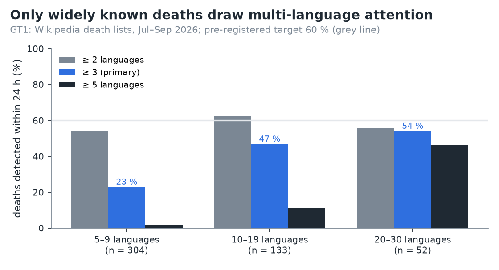
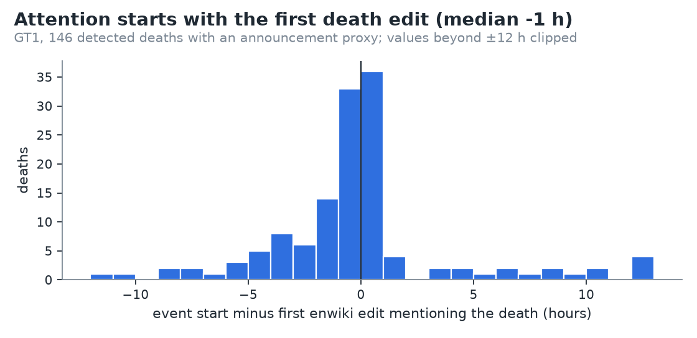
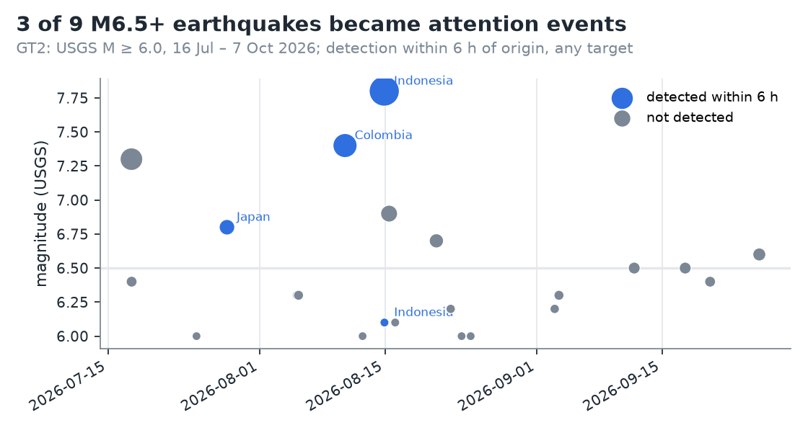
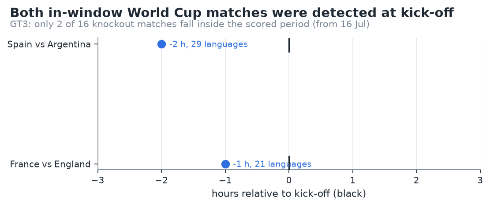

# Phase 2b results: sudden, timestamped events

- Pre-registration: [docs/prereg_phase2b.md](../prereg_phase2b.md), committed 2026-10-09 (`8ffa06e`) before any
  ground truth was fetched.
- Deviations and data issues: [ADR 0020](../adr/0020-phase2b-deviations.md). None of them changes a verdict.
- Detector: the Phase 2 primary configuration, unchanged. It requires R3 ≥ 8, R1 or R2, and ≥ 3 languages within 6 h.
  Any event counts, single- or multi-language ([ADR 0019](../adr/0019-single-language-events.md)).
- Raw outputs:
  - [`phase2b_metrics.json`](phase2b_metrics.json)
  - [`phase2b_gt1_deaths.csv`](phase2b_gt1_deaths.csv), [`phase2b_gt1_variants.json`](phase2b_gt1_variants.json)
  - [`phase2b_gt2_earthquakes.csv`](phase2b_gt2_earthquakes.csv)
  - [`phase2b_gt3_matches.csv`](phase2b_gt3_matches.csv), [`phase2b_gt3_excluded.csv`](phase2b_gt3_excluded.csv)
- Reproduce: `python -m lookedup.cli evaluate-v2` (add `--refresh` to re-fetch the ground truths).

## Summary

Phase 2 scored the detector against a news digest that mostly lists things nobody reads about suddenly. Phase 2b
asked a fairer question: when something happens at a known time, does attention show up? **Partly, and fast when it
does.**

| Hypothesis | Pre-registered claim | Result | Verdict |
|---|---|---|---|
| **H1b-1** deaths | ≥ 60 % of GT1 within their 24 h window | **32.5 %** (159 / 489) | **rejected** |
| **H1b-2** earthquakes | ≥ 70 % of M6.5+ within 6 h of origin | **33 %** (3 / 9) | **rejected** |
| **H1b-3** matches | ≥ 90 % within 3 h of kick-off | 100 % (2 / 2) | **inconclusive** (n < 5) |
| **H2b** quake lead language | ≥ 60 % lead in an affected-country language | 50 % (2 / 4) | **inconclusive** (< 5 qualifying) |
| **H5** quake delay | median ≤ 4 h | median **0 h** (n = 4, max 1 h) | **inconclusive** (< 5 detected) |

Key findings:
- **Detection is fast but sparse.** When an event is detected it starts in the hour of the trigger: the first death
  edit, the quake's origin hour, kick-off. Most deaths and most strong quakes never become multi-language events.
- **Recall depends on how widely known the person is.** It is 23 % for people with articles in 5–9 of our languages
  and 54 % for people with 20–30.
- **The 3-language rule is the main lever.** At ≥ 2 languages, death recall rises to 56 %; at ≥ 5 it falls to 9 %.

## GT1: deaths (H1b-1 rejected)

- **Source:** the en "Deaths in July/August/September 2026" lists.
  - 587 entries with sitelinks in ≥ 5 of our 30 languages.
  - 98 are out of window (their window starts before 16 Jul), leaving **489 scored**.
- **Detected:** 159, of which 151 are multi-language and 8 single-language events.
- **Lead languages of detections:** en 61, es 15, it 15, fr 10, de 9, nl 6, ru 6, zh 5.

| Languages with an article | n | Detected | Recall | ≥ 2 langs | ≥ 5 langs |
|---|---:|---:|---:|---:|---:|
| 5–9 | 304 | 69 | **22.7 %** | 54 % | 2 % |
| 10–19 | 133 | 62 | **46.6 %** | 63 % | 11 % |
| ≥ 20 | 52 | 28 | **53.8 %** | 56 % | 46 % |
| **All** | **489** | **159** | **32.5 %** | **56.4 %** | **9.2 %** |

**Post-hoc sensitivity (ADR 0020, not a verdict):**
- The literal "first wikilink" parse picks 19 non-person targets (`IMDb`, `Berlin`, …). Dropping them gives 33.6 %.
- Opening the window 24 h before the listed day gives 32.9 %. Both changes together give 34.0 %.
- No reasonable reading gets near 60 %.

**Why prominent deaths are missed.** We inspected the ten most widely linked real people who were missed:
- **Attention before the window.** Harald V's event began 27 Aug 07:00 UTC (preceded by an event on 23 Aug), 5 h
  before the window. Franco Baresi's began 29 Jul, two days before the listed date. The episode rule then merges
  the death into the earlier episode.
- **Attention after the window.** Chuck Russell's event began two days later (24 Jul) and Tony Gatlif's two days
  later (4 Sep), consistent with late announcements.
- **One-language attention.** Jon Kyl spiked hugely in English (surprise 1,029, 5,949 views/h) but only in English
  and French, so the event never formed.
- **No measurable rise at all.** Yayoi Kusama's English article stayed at ≈ 800 views/day, as before. Hideki
  Shirakawa, Margaret Hamilton, William Orbit and Toyohiro Akiyama have no spikes. For such entries, the hourly
  data shows no sudden attention around the listed date.

### Delay from announcement

For the 146 detected deaths with an announcement proxy (the first enwiki edit mentioning the death):
- event start minus proxy: **median −1 h**, IQR −2 h to 0 h (min −33, max +25);
- 87 % start within 4 h of the proxy, most of them before or in the same hour.

Reading attention and the first editor reaction arrive together. Hourly pageviews can't beat edits on speed, which
is what the feasibility study predicted (edits are the fast signal). They don't lag far behind either.

## GT2: earthquakes (H1b-2 rejected; H2b, H5 inconclusive)

- 22 USGS M ≥ 6.0 quakes from 16 Jul to 7 Oct; 7 got a Wikidata article within 48 h.

| Group | n | Detected within 6 h | Recall | ≥ 2 langs | ≥ 5 langs |
|---|---:|---:|---:|---:|---:|
| **M ≥ 6.5 (H1b-2)** | 9 | 3 | **33 %** | 33 % | 22 % |
| M ≥ 6.5, article target only | 9 | 1 | 11 % | | |
| M 6.0–6.5 | 13 | 1 | 8 % | | |

| Detected quake | M | Target that fired | Start (UTC) | Delay | Lead | Breadth |
|---|---:|---|---|---:|---|---:|
| Kumamoto, Japan | 6.8 | 2026 Kumamoto earthquake | 28 Jul 07:00 | 0 h | ja | 3 |
| San José del Palmar, Colombia | 7.4 | San José del Palmar, then Colombia (13:00, 20 langs) | 10 Aug 12:00 | 0 h | es | 3 |
| Flores Sea (Ende), Indonesia | 7.8 | Indonesia | 14 Aug 22:00 | 1 h | es | 6 |
| Ende aftershock, Indonesia | 6.1 | Indonesia (same event) | 14 Aug 22:00 | 0 h | es | 6 |

**Missed M ≥ 6.5 quakes:**
- Mexico 7.3. Its matched article was a wrong Wikidata item (ADR 0020).
- Pematangsiantar 6.9 (Indonesia).
- Tambo 6.7 (Peru, article exists).
- Two near Nikolski (Alaska), 6.3 and 6.5.
- Teluknaga 6.5 (Indonesia).
- New Caledonia 6.6.

Almost all are offshore or in remote areas.

**H5:** detection delay median 0 h (n = 4, max 1 h). That is far under 4 h, but below the pre-registered n = 5, so
inconclusive. Operationally, add 1 h for the hour to close and ≈ 2.2 h of dump lag: about 3–4 h from origin to
`latest.json`.

**H2b:** 4 detected quakes qualify.
- The lead language is a country language for Kumamoto (ja) and Colombia (es).
- It is not for the two Indonesian ones (lead es, not id).
- That gives 2 / 4, inconclusive. The Indonesian pair is a single event on the country article, which may mix the
  quake with unrelated attention (ADR 0020).

The quake articles themselves are slow. Colombia's article formed an event 12 h after origin, and the Flores M7.8
article never formed one. Articles are created and translated after the first reaction, so attention lands on the
**place** first.

## GT3: matches (H1b-3 inconclusive)

- Only the third-place match (France v England, 18 Jul) and the final (Spain v Argentina, 19 Jul) fall in the scored
  period. 14 earlier knockout matches are out of period; the tennis finals and Champions League qualifiers are
  excluded as pre-registered.
- Both were detected, 1 h and 2 h **before** kick-off, in 21 and 29 languages. This is pre-match attention.
- That is 2 / 2, but with n < 5 it is inconclusive, as anticipated.

## What we learned (Phase 2 + 2b, honestly)

1. **The detector measures what readers do, not what editors file as news.**
   - Phase 2: 4.3 % recall of the Current events portal.
   - Phase 2b: 32.5 % of notable deaths, 3 of 9 strong earthquakes, 2 of 2 in-period World Cup matches.
   - It catches scheduled spectacles and widely known people. It mostly misses conflict, politics, remote disasters
     and people known to one community.
2. **When it fires, it is fast.** Detections start in the hour of the trigger: quakes 0–1 h after origin,
   deaths with the first death edit (median −1 h), matches before kick-off. The bottleneck is Wikimedia's ≈ 2 h dump
   lag, not the detector.
3. **The 3-language rule is the main trade-off, and it cuts recall hard.**
   - At ≥ 2 languages, death recall would be 56 %. At ≥ 5, 9 %.
   - A ≥ 2 rule would also admit more single-community noise; Phase 2's false positives came from co-spikes.
   - We keep 3 as registered. The ablation is the honest description of the trade-off.
4. **Single-language events are not errors.** Many real events are one community's (ADR 0019): 511 of 11,127 events
   are single-language, including real Japanese deaths and marriages. They stay visible in a separate list.
5. **Breadth follows global fame, not local importance.** Phase 2's H2 (40.7 %) and Phase 2b's H2b (2 / 4) agree: the
   lead language is often not the affected country's. Small wikis cross thresholds earlier, and global readers
   arrive through the biggest editions.
6. **Pre-registration earned its keep.** Every hypothesis in both phases failed or was underpowered, and each
   failure taught something specific. The post-hoc variants (ADR 0020) move nothing by more than 1.5 points.
7. **Next:** edits as the fast signal. They arrive minutes after a death, not hours. Also: GT designs with enough
   items (a full World Cup, a year of quakes), and a GT1 parser that takes the first human link.

## Limitations

- **GT1 is English-centric** and uses day granularity. Notability is judged by en editors.
- **GT2 is small** (22 quakes, 9 of M ≥ 6.5). Place targets can coincide with unrelated attention, and Wikidata
  coordinates are noisy.
- **GT3 has 2 items.** The scored period starts after most of the World Cup.
- **Single analyst**; the inspection of missed deaths is descriptive.
