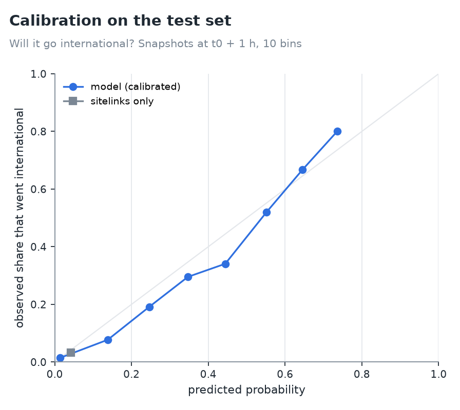
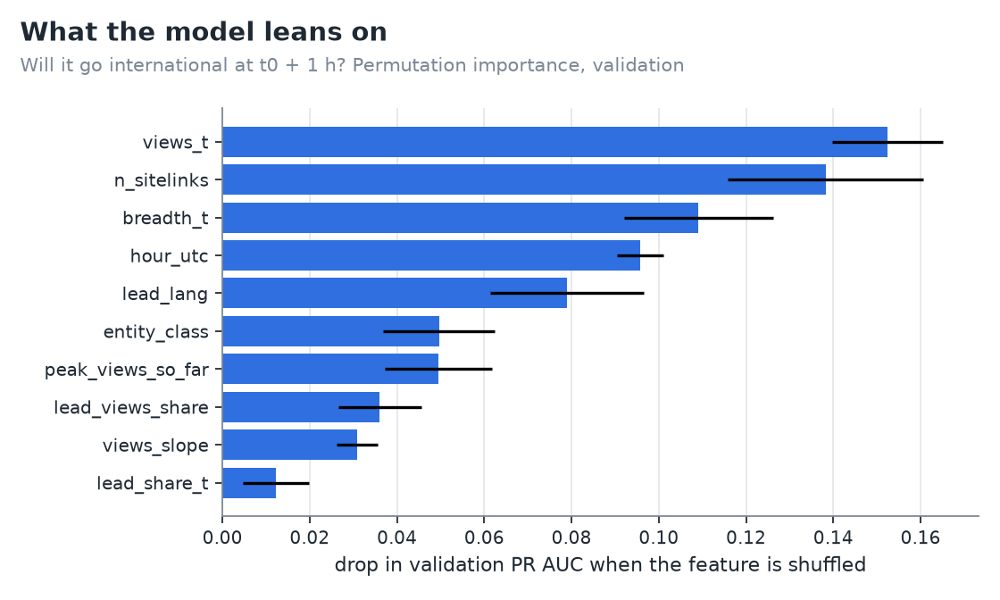

# Phase 4 results: forecasting spread and duration

- Pre-registration: [docs/prereg_phase4.md](../prereg_phase4.md), committed 2026-10-10 (`f5e895a`) before any
  forecasting code.
- Design choices that differ from the brief: [ADR 0028](../adr/0028-phase4-design-choices.md). Production choices:
  [ADR 0029](../adr/0029-forecast-production.md).
- Raw outputs: [`phase4_metrics.json`](phase4_metrics.json), [`phase4_examples.csv`](phase4_examples.csv), chosen
  parameters [`config/forecast_params.json`](../../config/forecast_params.json).
- Reproduce:
  - `python -m lookedup.cli warehouse build --select fct_event_snapshots`
  - `python -m lookedup.cli forecast-evaluate`
- **Data.** 99,381 snapshots of multi-language events: train 66,720, validation 12,090, test 20,571.
  - Test covers 20 Sep – 6 Oct and was scored once.
  - t0 is the detection hour, when the second language spikes (ADR 0028).

## Verdicts

| Hypothesis | Claim | Result | Verdict |
|---|---|---|---|
| **H6** | international at t0 + 1 h: AUC ≥ 0.80 and calibration slope 0.8–1.2 | AUC **0.875**, slope **0.83** | **supported** |
| **H7** | fame dominates: sitelinks alone ≥ 70 % of the model's PR AUC | 0.063 vs 0.310, **20 %** | **rejected** |
| **H8** | attention left beats category-median decay by ≥ 20 % MAE | MAE (log1p) 1.639 vs 2.205, **−26 %** | **supported** |

**We expected fame to dominate (H7) and said so in advance. It doesn't.**
- The number of Wikipedias with an article is the model's second most important feature.
- On its own, though, it ranks events barely better than chance among those that can still go international (PR AUC
  0.063 against a base rate of 0.033).
- What the model adds is the early reading itself.

## M1: will it go global? (test set, snapshots not yet at the tier)

| Model | n | positives | ROC AUC | PR AUC | Brier | slope | lift @10 % |
|---|---:|---:|---:|---:|---:|---:|---:|
| **international, t0** | 6,631 | 421 | **0.843** | **0.342** | 0.050 | 0.95 | 5.1 |
| base rate | | | 0.500 | 0.064 | 0.060 | | 1.0 |
| breadth ≥ 3 rule | | | 0.667 | 0.155 | | | 3.6 |
| sitelinks only | | | 0.687 | 0.110 | 0.058 | 0.84 | 2.1 |
| **international, t0 + 1 h** | 6,422 | 212 | **0.875** | **0.310** | 0.027 | 0.83 | 5.9 |
| base rate | | | 0.500 | 0.033 | 0.032 | | 0.8 |
| breadth ≥ 3 rule | | | 0.721 | 0.095 | | | 3.8 |
| sitelinks only | | | 0.701 | 0.063 | 0.032 | 0.83 | 2.3 |
| **international, t0 + 3 h** | 6,359 | 149 | **0.919** | **0.401** | 0.018 | 0.92 | 7.3 |
| base rate | | | 0.500 | 0.023 | 0.023 | | 0.8 |
| breadth ≥ 3 rule | | | 0.778 | 0.099 | | | 5.0 |
| sitelinks only | | | 0.720 | 0.050 | 0.023 | 0.81 | 2.9 |
| **planetary, t0** | 6,857 | **3** | 0.906 | 0.004 | 0.0004 | 0.98 | 6.7 |
| **planetary, t0 + 1 h** | 6,857 | **3** | 0.788 | 0.020 | 0.0006 | 0.53 | 6.7 |
| **planetary, t0 + 3 h** | 6,857 | **3** | 0.984 | 0.052 | 0.0006 | 0.39 | 10.0 |

- **The breadth rule** ("≥ 3 languages") catches 59 % of future international events at t0 + 1 h, at 11 % precision.
- **Planetary results rest on 3 test events.** They are reported, not interpreted. The app shows a planetary chance
  only above 30 %, with that warning.
- **All snapshots, including already-reached ones** (descriptive): AUC 0.96 and PR AUC 0.87 at t0 + 1 h. That's the
  kind of number that comes from counting events that already happened, which is why the pre-registered rows exclude
  them.
- **Sensitivity without `n_sitelinks` and `is_death`** (possible leaks): AUC 0.844 and PR AUC 0.227 at t0 + 1 h. The
  model loses about a quarter of its PR AUC but still clears H6's AUC bar.

- **Calibration** is good at the low end, where 89 % of snapshots sit: predicted 1.3 %, observed 1.4 %.
- In the middle it is **overconfident**: a predicted 44 % happened 34 % of the time. That is what a slope of 0.83
  means.
- The sitelinks-only baseline puts every snapshot in the lowest bin. Fame alone can't single out the event that will
  spread.

## M2: how long will it last? (test set, t0 + 3 h)

| Target | Model | Persistence (×24) | Category-median decay |
|---|---|---|---|
| attention left, next 24 h: MAE (log1p) | **1.639** | 2.387 | 2.205 |
| attention left: MAPE (log1p) | **0.23** | 0.56 | 0.52 |
| fade time: MAE (log1p) | 0.638 | 1.368 | **0.619** |
| fade time: median absolute error | 0.55 h | 3.0 h | **0.0 h** |

- **Attention left:** the model is clearly better than both baselines (H8).
- **Fade time:** the model does **not** beat the category median.
  - By t0 + 3 h most events are already below half their peak, so "it has faded" (0 h) is the best simple answer.
  - The app shows the fade ETA only while it lies in the future, and FIG. 05 says the fade forecast is no better than
    a rule.

## Rolling origin (4 weekly folds)

| Test week | Positives | AUC (intl, t0 + 1 h) | PR AUC | Calibration slope | M2 MAE | Decay MAE |
|---|---:|---:|---:|---:|---:|---:|
| 10–16 Sep | 127 | 0.909 | 0.463 | 1.30 | 1.628 | 2.474 |
| 17–23 Sep | 70 | 0.914 | 0.368 | 1.09 | 1.605 | 2.321 |
| 24–30 Sep | 89 | 0.879 | 0.365 | 0.81 | 1.626 | 2.204 |
| 1–6 Oct | 90 | 0.880 | 0.307 | 0.92 | 1.592 | 2.120 |

- AUC holds at 0.88–0.91 week to week, and M2 beats decay in every week.
- Calibration wanders (slope 0.81–1.30). Each week calibrates on only 7 days, so probabilities should be read as
  ±10 points.

## What the model leans on

Top 5 features for "international at t0 + 1 h" (drop in validation PR AUC when shuffled):

| Feature | Drop |
|---|---:|
| `views_t`: total views of the known articles at the snapshot hour | 0.152 |
| `n_sitelinks`: how many of our Wikipedias have an article (fame) | 0.138 |
| `breadth_t`: languages already spiking | 0.109 |
| `hour_utc` | 0.096 |
| `lead_lang` | 0.079 |

For attention left (M2), `views_t` dwarfs everything else: a drop of 1.94 in MAE against 0.38 for the next feature.

## Five example events (test set)

| Why | Event | Snapshot (t0 + 1 h) | Breadth then | Sitelinks | Forecast | Outcome |
|---|---|---|---:|---:|---|---|
| confident hit | Nirvana | 28 Sep 01:00 | 3 | 29 | 76 % international | reached 7 languages |
| false alarm | People's Party | 5 Oct 08:00 | 4 | 29 | 72 % international | stayed at 4 |
| missed | 2026 FIFA ASEAN Cup | 5 Oct 14:00 | 2 | 8 | < 1 % international | reached 5 |
| median call | Wang Manyu | 24 Sep 13:00 | 2 | 14 | 0.5 % international | stayed at 2 |
| attention left | Cindy Crawford | 21 Sep 06:00 (t0 + 3 h) | — | — | 543,568 extra views in 24 h | 675,392 (21 languages) |

## What the model actually learned (honest version)

1. **It is a "how much reading is already happening" detector first.**
   - The strongest signal is the volume of views in the hour of the snapshot, then how many languages are already
     spiking.
   - Events that go international are, mostly, events that are already big an hour after detection.
2. **Fame is necessary but not sufficient.** `n_sitelinks` is the second feature, so famous entities are where
   international events come from. Most spikes of famous entities stay small, though. Fame alone gets 20 % of the
   model's PR AUC, not the 70 % we expected.
3. **Time of day matters.**
   - `hour_utc` ranks fourth. When an event surfaces decides which audiences are awake for its first hours.
   - The model learns this from 3 months of data, so it is partly a calendar effect and could drift.
4. **The false alarms are informative.** People's Party (29 sitelinks, 4 languages) looked exactly like an event
   about to spread and didn't. National political stories often spike in a few neighbouring languages and stop.
5. **Duration is mostly unpredictable beyond "it's already fading".** The model sizes the remaining attention well,
   but the timing of the fade is no better than a category median.

## Limitations

- **Short history.** Twelve weeks of data, one season (World Cup, summer). Planetary events are too rare for reliable
  planetary forecasts.
- **Leak-prone features.** Sitelinks are from 7 Oct and death claims were fetched after the events. The sensitivity
  model shows the size of the effect: PR AUC 0.31 → 0.23.
- **Live features follow the batch definition exactly** (candidate rows only). Live M2 retraining targets are an
  approximation (ADR 0029).
