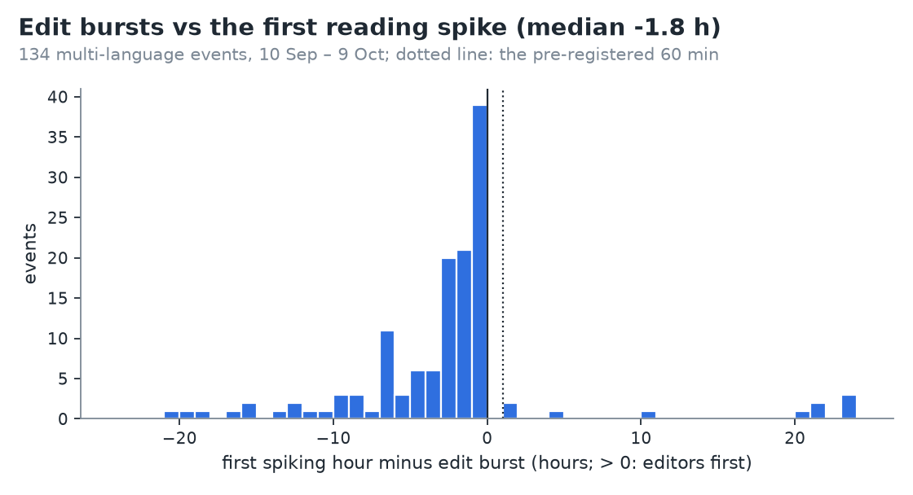

# Phase 5 results: the live editing layer

- Pre-registration: [docs/prereg_phase5.md](../prereg_phase5.md), committed 2026-10-10 (`d6ae84a`) before any Phase 5
  code or data.
- Hosting: [ADR 0030](../adr/0030-live-layer-hosting.md). Docker Spaces need a paid plan, so the live layer runs
  in GitHub Actions shifts. Warehouse refresh: [ADR 0031](../adr/0031-warehouse-refresh.md).
- Raw outputs: [`phase5_h9.csv`](phase5_h9.csv) (one row per event) and [`phase5_metrics.json`](phase5_metrics.json).
  H10 accumulates on the lake in `data/live/lead_time.csv`.
- Reproduce: `python -m lookedup.cli refresh-warehouse --end 2026-10-09`, then `python -m lookedup.cli live-h9`.

## Verdicts

| Hypothesis | Claim | Result | Verdict |
|---|---|---|---|
| **H9** | the edit burst precedes the first spiking hour by a median ≥ 60 min | median **−106 min** (IQR −295 to −43), n = 134 | **rejected** |
| **H10** | ≥ 2-language edit bursts within 30 min predict a reading event with precision ≥ 30 % | **no live event scored yet** (0 in the first 3 h of collection) | **inconclusive**: needs ≥ 100 scored live events; accumulating daily |

## H9: do editors lead readers? No, readers come first.

- **Population:** the 2,000 widest multi-language events of 10 Sep – 9 Oct (out of 11,601). Revision histories came
  from the MediaWiki API for the lead language and up to 4 more; the live layer's own burst rule was applied.
- **Edit bursts are rare on reading events.** Only **134 of 2,000 events (6.7 %)** had an edit burst under the
  pre-registered rule (≥ 5 edits by ≥ 3 editors in 30 minutes) within a day of the reading spike.
  - The share rises with breadth: 5.8 % at 2–4 languages, 6.5 % at 5–9, 10.9 % at 10–19.
  - 130 of the 134 were window bursts, 4 new-article bursts.
- **When there is a burst, it comes after the reading spike has started:** median **−106 minutes**. Only **7.5 %**
  of events had editors first.

| Category | Events with a burst | Median lead (min) |
|---|---:|---:|
| death | 35 | −53 |
| sports | 30 | −123 |
| other | 31 | −177 |
| human | 25 | −144 |
| entertainment | 11 | −29 |

- Deaths and entertainment are the closest to simultaneous. Editors update a death within the hour readers find it.
- **The few cases where editors came first** are scheduled or slow-building stories: the 2026 Bahrain Grand Prix
  (editors 21 h earlier), Resident Evil (+88 min), the 2026 FIFA ASEAN Cup (+119 min), and new articles written in
  Hebrew before an Israeli news story spread.
- **Examples of readers first:**
  - Princess Astrid, Mrs. Ferner: −54 min, Norwegian.
  - Eva Marie Saint: −21 min, English.
  - Marina Vlady: −46 min, French.
  - Lionel Messi on 6 Oct: −501 min.

### The useful nuance: editors beat the *data* about readers

- Pageviews for an hour are published about **3.2 h after that hour begins**: 1 h for the hour to close, plus the
  ≈ 2.2 h median dump lag.
- Measured against when reading data becomes **available**, the edit burst is known a median **86 minutes earlier**,
  in 70 % of the events with a burst.
- So the live layer is worth having, but not for the reason we pre-registered. It doesn't predict attention. It
  shows, about 1.5 h sooner, a sliver (≈ 7 %) of the attention that is already happening.

## H10: precision of live events (accumulating)

- **Collection.** The live layer has run continuously since 2026-10-10 07:13 UTC (gap 0 minutes).
  - In the first ≈ 3 h it saw 58 bursts: 47 new-article bursts and 11 window bursts.
  - It saw **no live event**: no item burst in two languages within 30 minutes.
- **No live event can be scored yet anyway.** Scoring needs floor_hour + 24 h of reading data plus ≈ 3 h of dump lag.
- **Accumulation.** `daily.yml` runs `cli live-score` every day. It scores the live events of two days ago against
  the lake's reading events and appends to `data/live/lead_time.csv` on the Hub. A repo file isn't used because
  pipelines never commit to the repo.
  - The pre-registered verdict is taken once **100 live events** are scored.
- **How long?** The first hours give no rate (0 live events on a quiet Saturday morning). H9 gives a rough bound:
  - About 26 reading events a day have a single-language edit burst (6.7 % of ≈ 390 multi-language events a day).
  - If 10–20 % of those burst in two languages within 30 minutes, that is 3–5 live events a day.
  - **100 scored live events would take ≈ 3–5 weeks.** Re-estimate after 7 days of collection.

## Update (Phase 5b): new host and tuned rules (ADR 0032)

- **Hosting.**
  - The GitHub Actions shifts stopped on 2026-10-10 at 11:11 UTC (`live.yml` is manual only): chained always-on jobs
    conflict with Actions' usage terms.
  - Hugging Face Gradio Spaces also need a paid plan (402).
  - The live layer now runs as a **Cloudflare Worker** that polls `recentchanges` every 5 minutes. Distinct editors
    are counted with salted 64-bit sketches, so no user names are kept.
- **Rules** (`config/live.yml`):
  - new-article bursts need **≥ 2 distinct editors**;
  - live events group bursts within **120 minutes** (was 30);
  - the strip ranks single-language bursts by distinct editors (top 5);
  - live events are counted per hour over a week, to judge the new rules.
- **The hypotheses are unchanged.** H9 and H10 keep the pre-registered rules (`config/live_prereg_phase5.yml`). H10's
  units now exclude single-author new-page bursts at the source, which is noted in its report.
- **The strip now says "editors are confirming"** and explains that readers usually get there first.

## What we learned

1. **The premise was half right.** Editors react in minutes, but on average to stories readers are already
   reading. On Wikipedia, attention leads editing, not the other way round.
2. **Edit bursts mark a small, specific slice of attention:** deaths, sports results and pre-announced events. Most
   reading spikes (93 % here) never produce a burst of ≥ 3 editors in 30 minutes.
3. **The live layer still beats the pageview pipeline** by about 1.5 hours for that slice. That is what the "Right
   now" strip shows, labelled as what editors are updating, not as what the world reads.
4. **The new-article rule is noisy.** Most live bursts are single authors writing new articles. It was
   pre-registered and stays as it is. A future version could require ≥ 2 editors for new-article bursts too.

## Limitations

- **Hour granularity.** Reading spikes are hourly, and the first spiking hour is compared by its start. Even against
  the end of the hour, the median is still −46 min.
- **Revision filters.** API revisions have no bot flag; accounts named "…bot" are dropped. Undetected bots could
  only add bursts, and would make editors look earlier, not later.
- **Only part of the population.** H9 covers the widest 2,000 events, not all 11,601. Narrow events burst less
  often.
- **No live baseline yet.** The live baseline is the 1.0 default until 24 h of history exist. The backtest used the
  default throughout, as pre-registered.
