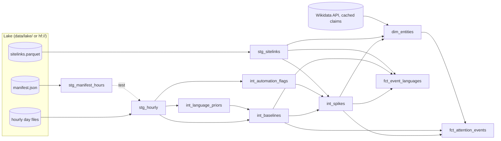

# Warehouse (dbt-duckdb)

The analytics warehouse turns the hourly lake into spikes and multi-language **attention events**. Definitions are
pre-registered in [prereg_phase2.md](prereg_phase2.md). Thresholds live in
[config/analytics.yml](../config/analytics.yml). Implementation choices are in
[ADR 0013](adr/0013-phase2-implementation-and-deviations.md).

## Run it

```bash
.venv/bin/pip install -e ".[warehouse]"
.venv/bin/python -m lookedup.cli sync --from 2026-07-09     # mirror the lake into data/lake/ (recommended)
.venv/bin/python -m lookedup.cli warehouse build            # dbt build: models + tests
.venv/bin/python -m lookedup.cli warehouse build --hf       # same, reading hf:// directly (much slower)
```

- **Local sync is the default and is preferred for speed.** The models scan ~1.1 B rows (91 days). Reading local
  Parquet is about 10× faster than streaming the same files over HTTP for every query.
- `lookedup.cli warehouse` runs dbt **in-process** with vars taken from `config/analytics.yml` and the active
  language list. The project and profile live in [`warehouse/`](../warehouse). The DuckDB file is
  `data/warehouse/lookedup.duckdb` (git-ignored).
- The three heavy models are **incremental Python models that loop over days**. Each day's SQL comes from
  `lookedup.analytics.scoring`, the same builders the hourly production scorer uses. A re-run only processes days not yet built.

## Lineage



## Models

| Model | Grain | Materialisation | What it holds |
|---|---|---|---|
| `stg_hourly` | (hour, lang, title) | view | typed views, `views = desktop + mobile`, `mobile_share`, calendar fields; period 2026-07-09 to 2026-10-07 |
| `stg_sitelinks` | (lang, title) | table | numeric QID |
| `stg_manifest_hours` | hour | table | rows and source per hour from the manifest |
| `int_automation_flags` | (lang, title, day) | incremental (python, by day) | rows with ≥ 500 views/day; `is_low_mobile`, `is_flat`, `is_automated` |
| `int_language_priors` | (day, lang) | incremental (python, by day) | prior median/MAD for unseen entities |
| `int_baselines` | (hour, lang, title) | incremental (python, by day) | every article-hour with ≥ 100 views (evaluation period): baseline level, median, MAD, R1/R2 inputs, surprise |
| `int_spikes` | (hour, lang, title) | table | rows with R1 or R2 and surprise ≥ 6 (lowest ablation), plus QID, automation flags and `is_spike` (primary rule) |
| `dim_entities` | qid | table (python) | QIDs that form an event under the loosest ablation: labels in the 30 languages, Wikidata class, P570, P17, P276 |
| `fct_attention_events` | event | table (python) | primary-configuration events: start, lead language, breadth, peak, excess views, spread lags, category |
| `fct_event_languages` | (event, lang) | table (python) | first spike, spread lag, peak and excess views per language |

## Tests

`dbt build` runs:

- uniqueness and not-null on every key (`flag_id`, `candidate_id`, `spike_id`, `qid`, `event_id`, `event_lang_id`);
- accepted values: languages, baseline levels, sources, classes and categories;
- relationships: events → entities, event languages → events;
- the custom `assert_stg_rows_match_manifest` test: row counts per hour in `stg_hourly` equal the manifest's, for 3
  hash-chosen days.

The Python package tests (`pytest`) cover the SQL builders and the event logic on synthetic data.
